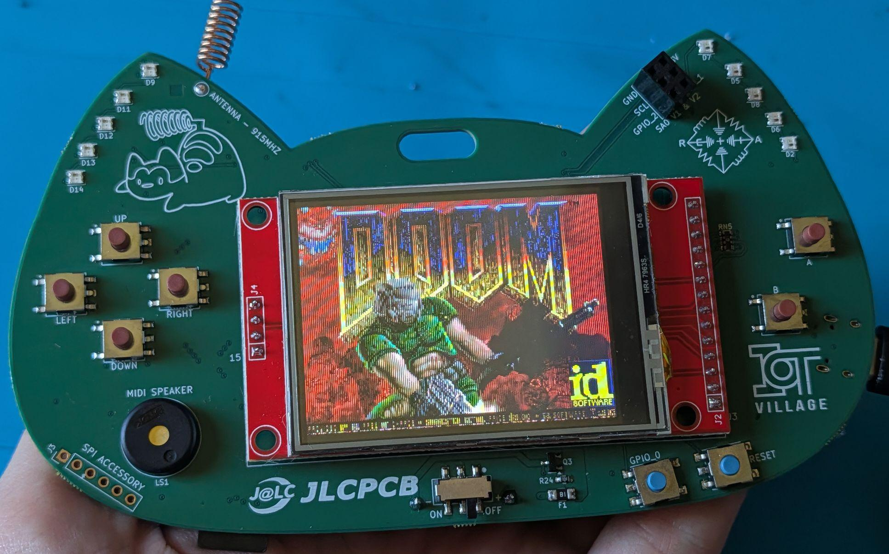

# DEF CON Badge (2024) — ESP32-S3

Everything you need to hack on the Retia DEF CON badge: hardware docs, pinouts, flashable firmware (including **DOOM**, a full **NES emulator**, **Meshtastic**, and **Reticulum**), and example code to get you from "just unboxed" to writing your own firmware.



*Yes, that's DOOM. Flash it in one command — see below.*

## What's on the badge

| | |
|---|---|
| MCU | ESP32-S3-WROOM-1 — dual-core 240 MHz, WiFi + BLE, **8 MB flash**, **2 MB PSRAM**, native USB-C |
| Display | 2.4″ ILI9341 240×320 color TFT + XPT2046 resistive **touch** (MSP2402 module) |
| Radio | RFM95W **LoRa** 915 MHz (SX1276), U.FL antenna |
| Input | 6 face buttons (d-pad + A/B) + BOOT button usable as a 7th |
| Storage | micro-SD slot (tested to 16 GB SDHC) |
| Blinkies | 10× WS2812B NeoPixels, green debug LED |
| Sound | Piezo buzzer (MOSFET-driven) |
| Expansion | SAO v2, QWIIC (I²C), UART header, SPI header, off-board NeoPixel connector |
| Power | 2×AA (boost) or USB-C, auto-switching |

## Quick start: flash DOOM

```bash
pip install esptool
esptool --chip esp32s3 --port <PORT> write-flash 0x0 firmware/doom/doom-audio.factory.bin
```

`<PORT>` is `/dev/cu.usbmodem*` (macOS), `/dev/ttyACM0` (Linux), or `COMx` (Windows). Full instructions, port-finding, and un-bricking: [docs/flashing.md](docs/flashing.md).

## Repo map

```
docs/            pinout.md ← START HERE · hardware.md · flashing.md · sd-card.md
firmware/
  doom/          DOOM shareware, audio + silent builds (flash & play)
  meshtastic/    Meshtastic 2.7.23, standard + low-power builds
  reticulum/     RNode v1.85 — the badge as a Reticulum LoRa transceiver
examples/
  hello-badge/   buttons + LED + buzzer in 100 lines (your first build)
  sd-test/       mount/format/read/write the micro-SD slot
hardware/        KiCad 8 sources + schematic PDF
```

## The three things that bite everyone

1. **The touch controller and the display-module SD slot have crossed data lines** — hardware SPI can't reach them. The main SD slot and everything else work normally. Details: [docs/pinout.md](docs/pinout.md#hardware-quirks).
2. **Native-USB download-mode trap** — DTR-toggling serial monitors + reset = badge stuck "waiting for download". Fix: any esptool command ending in hard-reset. Details: [docs/flashing.md](docs/flashing.md#recovery).
3. **Never TX on LoRa without an antenna.** Receiving is safe; transmitting into nothing can cook the PA.

## Firmware in this repo

- **[DOOM](firmware/doom/)** — the 1993 classic, natively, full speed. D-pad moves, A fires, GPIO0 switches weapons. Audio build plays SFX through the piezo.
- **[Meshtastic](firmware/meshtastic/)** — off-grid LoRa mesh messaging with phone app support; standard, power-optimized, and experimental **color touch UI** builds.
- **[Reticulum / RNode](firmware/reticulum/)** — turns the badge into an [RNode](https://unsigned.io/rnode/): a host-controlled 915 MHz LoRa transceiver for the [Reticulum network stack](https://reticulum.network) (NomadNet, Sideband, MeshChat). Flash, provision with `rnodeconf`, done — hardware-verified against a Nibble Zero RNode. Full toolkit, source, and Nibble Zero builds live in **[RetiaLLC/NibbleReticulum](https://github.com/RetiaLLC/NibbleReticulum)**.
- **[Anemoia NES](https://github.com/RetiaLLC/Anemoia-DefconBadge)** *(standalone repo)* — a full NES emulator: put `.nes` ROMs on the micro-SD card, browse and launch them on the badge, and play with the D-pad + A/B. Save states, chiptune audio through the piezo, and a one-button START/SELECT scheme (tap BOOT = START, hold = pause menu). Ready-to-flash image on the [release page](https://github.com/RetiaLLC/Anemoia-DefconBadge/releases/latest) (also attached to this repo's `anemoia-v1.0.0` release), plus a [curated list of legally-free homebrew games](https://github.com/RetiaLLC/Anemoia-DefconBadge/blob/main/GAMES.md) tested on the badge. Ported from [Shim06/Anemoia-ESP32](https://github.com/Shim06/Anemoia-ESP32).

## Building your own firmware

Both examples are PlatformIO ESP-IDF projects with the badge board definition included — copy one as a template. The short version:

```bash
pip install platformio
cd examples/hello-badge
pio run -t upload --upload-port <PORT>
```

Then open a serial monitor at 115200 and press buttons.
