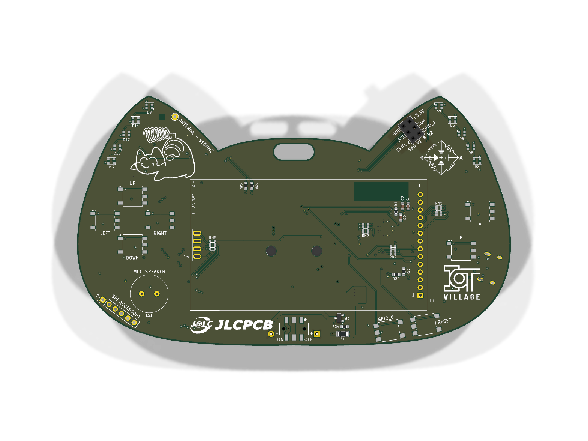
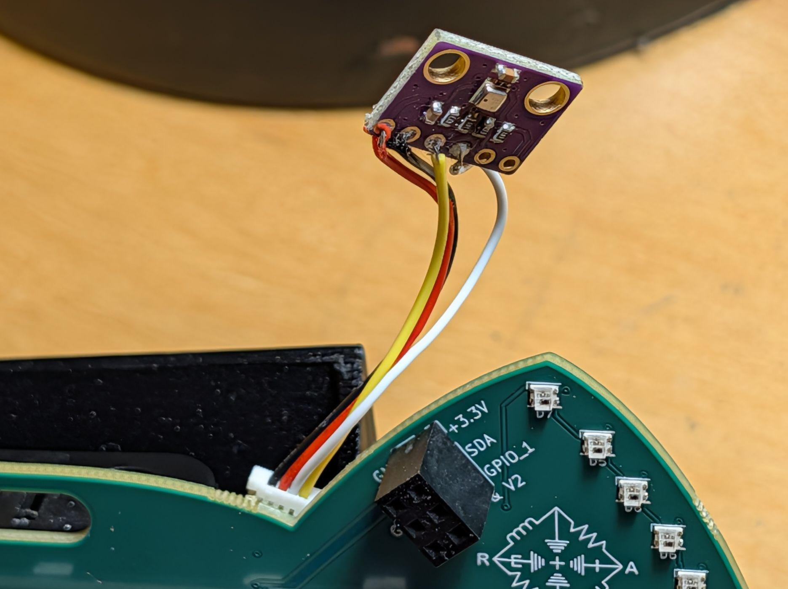

# ESP32 Bus Pirate on the DEF CON Badge — Beginner's Guide

> Turn your badge into a **multi-protocol hardware & radio analysis multitool** with
> a live color display. This guide gets you from "just flashed" to running eye-catching,
> hands-on demos — **no laptop screen required, the badge shows you everything.**
>
> Every command and on-screen result below was tested on the actual badge on a bench.

## Jump to

- [Quick start](#quick-start) — flash, connect, the CLI basics
- [LoRa demos](#lora-demos-the-stars) ⭐ — waterfall, sniffer, RSSI meter, scanner, Meshtastic/MeshCore
- [I²C sensor dashboard](#i2c-sensor-dashboard) — scan + decode a sensor on screen
- [GPIO pin tools](#gpio-pin-tools) — "is this pin alive?" + on-screen logic/analog scope
- [Wi-Fi](#wi-fi) — scan, MAC lookup, and driving the badge wirelessly
- [Bluetooth LE](#bluetooth-le) — scan the air
- [UART](#uart) — sniff a live serial line
- [LED ears](#led-ears) — because it's a badge
- [Needs an add-on module](#needs-an-add-on-module) — what's *not* on the badge
- [Command reference](#command-reference)

> ⚠️ **Radio safety & authorization.** This build can transmit (LoRa/Wi-Fi/BLE) and
> includes attack-capable commands (deauth, spoof, jam, spam). **Only test hardware,
> networks and RF you own or have written permission to test.** This guide sticks to
> **passive, receive-only demos** — the safe, always-legal stuff. Never transmit on
> LoRa without a 915 MHz antenna attached, or you can damage the radio.

---

## Quick start

1. **Flash** the badge — browser flasher at [catbadge.online](https://catbadge.online), or `esptool … write-flash 0x0 buspirate-badge.factory.bin`.
2. **Tap RESET.** It boots straight to the USB-serial CLI at **115200 baud**.
3. Useful anywhere:
   - `help` — commands for the current mode · `man` — built-in topic guide (examples, syntax, safety)
   - `mode` — list protocols · `mode <name>` — enter one (prompt changes: `I2C>`, `LORA>`, …)
   - `system` — opens a status shell (summary, memory, network, partitions, reboot…); pick `1` for the summary
   - `mode hiz` — safe idle · **ENTER** — stop a running command

> 💡 **Entering a mode asks a few setup questions** (pins, speed, radio settings), each
> showing its default in brackets like `SDA GPIO [35]:` — **just press ENTER to accept
> every default.** All examples below assume you took the defaults.

You can also drive the whole CLI **from a browser** (no terminal app) or **over Wi-Fi** —
see [Drive it wirelessly](#wi-fi).

### Where things are



The bits this guide uses: the **SAO port** (top-right, labelled `+3.3V / SDA / SCL /
GPIO_1 / GPIO_2 / GND`) for I²C add-ons; the **d-pad + A** for the boot menu; **A / B /
RESET** buttons; the **915 MHz antenna** pad for LoRa; and the **SPI accessory** header.
The **Qwiic (J6)** I²C connector is on the back.

---

## LoRa demos (the stars) ⭐

LoRa is where the on-screen demos shine.
```
mode lora
```
It reports the on-board radio (`RFM95W / SX127x`) and asks *"Configure radio settings?"* —
answer **N** for the sensible defaults. You're at `LORA>`.

> Attach the **915 MHz antenna** before anything that transmits (`send`, `spam`). The
> receive/scan demos are safe without one, but signals will be weak.

| Command | What the screen does |
|---|---|
| `waterfall` | **Heat-map spectrum analyzer** — blue/green where quiet, **yellow/red where something transmits**; peak frequency in the header. Try Start `902` End `928` Step `0.1`. |
| `rssi` | **Big live signal meter** + colored bar + held-peak marker. Move a transmitter closer, the bar climbs and turns red. |
| `scan` | **Peak-hold heat spectrum** across a range — every channel that's been active lights up and stays lit. |
| `receive` | **Packet sniffer** — a rolling on-screen list of frames: number, **RSSI**, length, ASCII preview. Have another badge `send hello world`. |
| `send <text>` | Transmit a frame (needs the antenna). Two badges: one `receive`, the other `send`. |

**Meshtastic monitor** — the badge decodes *real* Meshtastic:
```
mesh
```
From the numbered menu: **2** → preset `LongFast`, **3** → frequency `906.875`, **4** →
channel key `AQ==`, **7** → **Receive packets**. The screen becomes a **Mesh Monitor**
showing decoded packets — `!nodeid` + text/type — for any Meshtastic traffic on the
default channel. (Verified decoding live packets from a stock Meshtastic node.) Menu
**6** sends a text a real Meshtastic node/phone will receive.

**MeshCore sniffer** — one command:
```
meshcore
```
Tunes the radio to MeshCore's default US PHY (`915 MHz / SF10`) and drops into the
on-screen sniffer. MeshCore frames appear as RSSI + raw bytes (group payloads are
AES-128 encrypted, so they show raw, not decoded). It's a *separate* mode from
Meshtastic — different frequency/spreading-factor, can't monitor both at once.

---

## I²C sensor dashboard

The best hands-on demo if you have a sensor. Wire it to the badge's **Qwiic connector
`J6`** (the white JST) — match the sensor's **3V3 · GND · SDA · SCL** to the badge:



> ⚠️ **`J6` (Qwiic) is pin-reversed vs a standard Qwiic/STEMMA cable** (see
> [`docs/hardware-errata.md`](../../docs/hardware-errata.md)) — a plug-and-play cable
> lands power/ground scrambled. **Hand-wire the four lines to match** the badge's
> silkscreen (`+3.3V / SDA / SCL / GND`), exactly like the photo above. Either I²C
> connector works — **`J5` (the SAO port)** carries the same bus (see below).

The badge's whole I²C bus is **SDA = GPIO35, SCL = GPIO36** — those are the default
`mode i2c` pins, and they're wired to *both* `J6` (Qwiic) and `J5` (the SAO port).

```
mode i2c
```
Answer `SDA GPIO [35]:`, `SCL GPIO [36]:`, `Frequency [100000]:` — **ENTER three times**.
Then:
```
scan
```
The screen shows a **device list**; serial prints `Found device at 0x76`. A BME280/BMP280
environment sensor answers at `0x76` (or `0x77`).
```
bme 0x76
```
Decodes the sensor **onto the badge**: a two-column **BME280** dashboard with **T / H / P**
(e.g. `T 24.9 C · H 49 %RH · P 1001 hPa`) plus raw registers — and **the ear LEDs change
color with the temperature.** Warm the sensor with your fingers and watch both move.
`monitor <addr>` mirrors live register reads to the screen. ENTER stops.

---

## Talk to an SAO on the SAO port

The **SAO port (`J5`)** — the standard 1×6 add-on header — is wired straight to the same
I²C bus (**SDA GPIO35 · SCL GPIO36**) plus two GPIOs (**GPIO1, GPIO2**, on pins 5 & 6).
So you can interrogate anything plugged into it with **no extra wiring**:

- **I²C parts on the SAO** (sensors, EEPROMs, LED drivers): `mode i2c` → `scan` finds the
  address, then `read` / `dump` / `bme` / `monitor` — same as the sensor dashboard above.
- **The SAO's two GPIO lines** (GPIO1, GPIO2): scope them on the badge screen with
  `logic 1` / `logic 2` (digital waveform) or `analogic 1` (live voltage), or poke them in
  `mode dio` (`read 1`, `measure 1`).

Great for reverse-engineering a mystery SAO: **scan its I²C address, then scope its GPIO
pins** — all from the badge, no laptop.

---

## GPIO pin tools

"Is this pin alive?" — and two commands that draw a **scope trace on the badge screen**.
These work from any prompt (they're global).

> **Use a broken-out GPIO**, not a reserved one. Safe to probe on this badge:
> **1, 2, 18, 35, 36, 37** (SAO/accessory header) and **43, 44** (UART header). The
> d-pad, flash and PSRAM pins are protected and will say *"GPIO is protected."*

```
logic 35
```
**On-screen logic analyzer** — samples a digital pin and draws its **waveform on the TFT**
(title `Logic Analyzer · GPIO 35`). Point it at a clock, a data line, any toggling pin; a
floating pin just reads flat.

```
analogic 1
```
**On-screen analog scope** — plots a pin's changing **voltage** as a live green trace (ADC
pins are GPIO 1–10). Good for a potentiometer, an analog sensor output, a drifting rail.

For quick checks, `mode dio` gives a pin toolkit:
```
mode dio
read 35        # instantaneous logic level  ->  GPIO 35 = 0 (LOW)
measure 35     # counts edges for 1 s and reports the frequency
sniff 35       # stream edge changes
```
Great for figuring out whether a pin is a clock, a data line, or dead.

---

## Wi-Fi

```
mode wifi
scan
```
Lists nearby **access points** — SSID, security, BSSID, channel, signal. Fully passive.
Handy follow-ups:
```
sniff                       # passive beacon/probe capture, cycling channels
connect <SSID> <password>   # join a network (needed for the online tools below)
lookup AA:BB:CC:DD:EE:FF    # MAC -> vendor  (requires connect first)
```

**Drive the badge from a browser or over Wi-Fi:**

- **Easiest — browser Web Serial.** Plug in over USB and use the terminal at
  [catbadge.online](https://catbadge.online) — no app, no Wi-Fi. Works in **Firefox**,
  Chrome, or Edge (Firefox added Web Serial support, so it's no longer Chromium-only).
- **Over Wi-Fi (no cable) — the web CLI is a *boot mode*, not a serial command.**
  **Reset the badge** — a terminal-type menu appears for ~6 s: **d-pad LEFT/RIGHT** to
  highlight **WiFi Hotspot**, then press **A** to select (no input defaults to USB). The
  badge makes its own Wi-Fi network **`ESP32-Bit-Pirate`** (password `readytoboard`) and
  serves the **entire CLI as a web page** — connect to it and open **192.168.4.1** in any
  browser (verified: the badge serves the CLI page to a connected client).

> The plain `ap <ssid> <password>` serial command just makes a bare access point (no CLI) —
> it's for bridging, not the web UI. To serve the web CLI you must **boot** into a Wi-Fi mode.

> The `deauth`, `spam`, `spoof`, `flood` commands here are transmit/attack — **authorized
> use only**, not part of this guide.

---

## Bluetooth LE

```
mode bluetooth
scan
```
Lists nearby **BLE advertisers** — MAC, RSSI, name/flags. Expect a sea of phones and
earbuds broadcasting proximity beacons (Apple Continuity, Google Nearby), all with
**randomized MACs** — a nice live lesson in BLE privacy.

---

## UART

UART shines pointed at a **real serial source** — e.g. the bench's own UART console.
Wire the badge's UART **RX (GPIO44)** to the source's **TX**, and **GND to GND**.
```
mode uart
autobaud        # auto-detects the line's baud rate (listens on RX GPIO 44)
snifftxt        # streams decoded text as it flows by  (sniffraw = raw hex)
```
That turns the badge into a passive serial tap — great for reading what a device chatters.

---

## LED ears

```
mode led
```
Answer the setup — LED count **10**, and a **low brightness like 40** (the ears are bright;
high brightness on USB-only power can brown out the board). Then:
```
rainbow          # moving rainbow
fill 00FF00      # solid green   (fill 000000 = off)
set 3 FF0000     # light a single ear by index
```

---

## Needs an add-on module

Many Bus Pirate modes need an **external chip/module the badge doesn't carry**. They work
if you wire the module to the SAO/accessory header, but they're **not** plug-and-play demos:

- **SPI** (`mode spi`) — needs an SPI flash/EEPROM to `sniff`/dump.
- **1-Wire** (`mode 1wire`) — needs a DS18B20, iButton, etc.
- **Sub-GHz** (CC1101), **RF24** (nRF24L01), **CAN** (MCP2515), **RFID/NFC** (PN532),
  **FM** (Si4713), **Cellular** (GSM/LTE modem), **Ethernet** (W5500), **Infrared**
  (IR LED/receiver), **Smart-card**, **Microwire/3-wire**, **I²S** audio — each needs its
  named module.
- **JTAG/SWD** scanning — needs a target MCU on the jumpers.

**On-board and ready right now:** LoRa, I²C, UART, 1-Wire, GPIO/DIO, LED (ears), Wi-Fi,
BLE, USB-HID, SD card, and the on-screen `logic`/`analogic` scope.

---

## Command reference

| Mode | Enter | Star demo | Also |
|---|---|---|---|
| **LoRa** | `mode lora` | `waterfall`, `rssi`, `scan`, `receive`, `mesh`→7 | `send`, `meshcore`, `status` |
| **I²C** | `mode i2c` | `scan`, `bme 0x76` | `monitor`, `ping`, `read` |
| **GPIO** | *(global)* / `mode dio` | `logic <pin>`, `analogic <pin>` | `measure`, `read`, `sniff` |
| **Wi-Fi** | `mode wifi` | `scan` | `lookup`, `sniff`, `ap` (web CLI) |
| **BLE** | `mode bluetooth` | `scan` | `sniff`, `status` |
| **UART** | `mode uart` | `autobaud` → `snifftxt` | `sniffraw`, `bridge` |
| **LED** | `mode led` | `rainbow` | `fill RRGGBB`, `set <i> RRGGBB` |

**Anywhere:** `help` · `man` (topic guide) · `mode` (list) · `system` (status shell) · `mode hiz` (idle) · **ENTER** (stop).

---

*Ported from [KonradIT/ESP32-Bus-Pirate](https://github.com/KonradIT/ESP32-Bus-Pirate)
(recipes: [geo-tp.github.io/ESP32-Bit-Pirate](https://geo-tp.github.io/ESP32-Bit-Pirate/recipes/)).
On-screen LoRa/I²C demos and the Meshtastic/MeshCore tooling are Retia badge additions.
Transmit- & attack-capable — authorized use only.*
